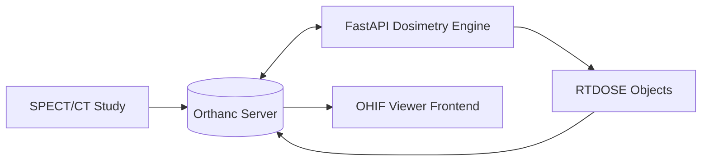

# ☢️ Standalone Radioembolization Dosimetry Platform
### *Integrated Precision Voxel-Based Dosimetry for Y-90 Radioembolization*

[](https://opensource.org/licenses/MIT)
[](https://fastapi.tiangolo.com/)
[](https://simpleitk.org/)
[](https://www.orthanc-server.com/)

A standalone, integrated version of the Taranis Dosimetry suite. This repository provides the core backend logic, automated DICOM workflows, and frontend viewing configurations required to perform high-precision dosimetry in a clinical or research environment.

---

## 🚀 Key Capabilities

- **🎯 Voxel-Based Precision:** Moving beyond compartmental models to provide true 3D voxel-by-voxel dose calculation.
- **🔄 Automated Workflow:** Integrated with **Orthanc** to automatically fetch SPECT/CT studies and push results back as standard **RTDOSE** objects.
- **🖥️ Clinical Viewer:** Custom configuration for **OHIF Viewer**, allowing radiologists to visualize dose maps overlaid on anatomical data.
- **📦 Dual-Mode Deployment:** Run as a lightweight Python service or as a full containerized stack via Docker Compose.

---

## 🏗️ System Architecture



---

## 🛠️ Technology Stack

| Layer | Technology |
| :--- | :--- |
| **Calculation Engine** | Python 3.10 + SimpleITK + NumPy |
| **API Layer** | FastAPI + Uvicorn |
| **DICOM Handling** | PyDicom |
| **Storage & PACS** | Orthanc DICOM Server |
| **Visualization** | OHIF Viewer (integrated via config) |

---

## 📦 Deployment Options

### 1. The Full Stack (Recommended)
Deploy the entire ecosystem (Orthanc + Backend + Viewer) in one command:
```bash
docker-compose up --build
```

### 2. Standalone Backend
Run only the dosimetry logic locally:
```bash
# Navigate to backend
cd app/backend
pip install -r requirements.txt

# Run server
python main.py
```
*Note: Requires an instance of Orthanc reachable at `localhost:8042`.*

---

## 🔬 Scientific Basis
The dosimetry engine implements the standard MIRD voxel-S-value approach, adapted for clinical radioembolization (Y-90). It accounts for:
- Liver mass and density
- Lung shunt fraction (LSF)
- Voxel-level activity distribution from SPECT/CT

---

## ⚖️ Disclaimer
*Taranis Dosimetry is an open-source tool for research and educational purposes. It is not FDA/CE cleared for primary clinical diagnosis or treatment planning. Always validate results against approved clinical software.*

---

**Developed by [Dr. Sunil Kalmath](https://github.com/drlighthunter)**  
*Innovating at the intersection of Interventional Radiology and Computational Science.*
