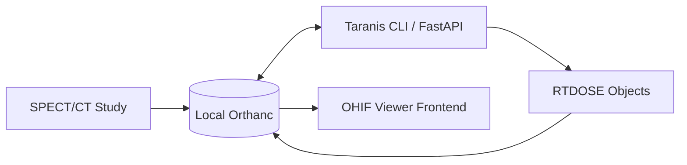

# ☢️ Taranis: Standalone Radioembolization Dosimetry
### *Integrated Precision Voxel-Based Dosimetry for Y-90 Radioembolization*

[](https://opensource.org/licenses/MIT)
[](https://brew.sh/)
[](https://fastapi.tiangolo.com/)
[](https://simpleitk.org/)

A standalone, integrated version of the Taranis Dosimetry suite. This repository provides the core backend logic, automated DICOM workflows, and frontend viewing configurations required to perform high-precision dosimetry in a clinical or research environment—**optimized for native deployment via Homebrew.**

---

## 🚀 Key Capabilities

- **🎯 Voxel-Based Precision:** True 3D voxel-by-voxel dose calculation using the MIRD voxel-S-value approach.
- **🍺 Homebrew Ready:** Install natively on macOS/Linux without Docker. Single-command installation and execution.
- **🔄 Automated Workflow:** Native integration with **Orthanc** to fetch SPECT/CT studies and push results back as **RTDOSE** objects.
- **🖥️ Clinical Viewer:** Custom configuration for **OHIF Viewer**, allowing radiologists to visualize dose maps overlaid on anatomical data.

---

## 🏗️ System Architecture



---

## 📦 Installation & Deployment

### 1. The Homebrew Way (Recommended)
Taranis is now a first-class CLI tool. No Docker or manual Python management required.

```bash
# First, install the DICOM server
brew install orthanc

# Install Taranis Standalone directly from this repository
brew install --build-from-source https://raw.githubusercontent.com/drlighthunter/Radioembolization-dosimetry-standalone-temp/main/Formula/taranis-dosimetry.rb

# Launch the platform
taranis-dosimetry
```

### 2. Manual Python Setup
For developers who prefer manual control:
```bash
cd app/backend
pip install -r requirements.txt
python main.py
```

---

## 🛠️ Technology Stack

| Layer | Technology |
| :--- | :--- |
| **CLI & Packaging** | Homebrew (Formula + Bottle ready) |
| **Calculation Engine** | Python 3.10 + SimpleITK + NumPy |
| **API Layer** | FastAPI + Uvicorn |
| **DICOM Handling** | PyDicom |
| **Storage & PACS** | Orthanc DICOM Server (Native or Brew) |

---

## 🔬 Scientific Basis
The dosimetry engine implements the standard MIRD voxel-S-value approach, adapted for clinical radioembolization (Y-90). It accounts for:
- Liver mass and density
- Lung shunt fraction (LSF)
- Voxel-level activity distribution from SPECT/CT

---

## ⚖️ Disclaimer
*Taranis Dosimetry is an open-source tool for research and educational purposes. It is not FDA/CE cleared for primary clinical diagnosis or treatment planning. Always validate results against approved clinical software.*

---

**Developed by [Dr. Sunil Kalmath](https://github.com/drlighthunter)**  
*Innovating at the intersection of Interventional Radiology and Computational Science.*
